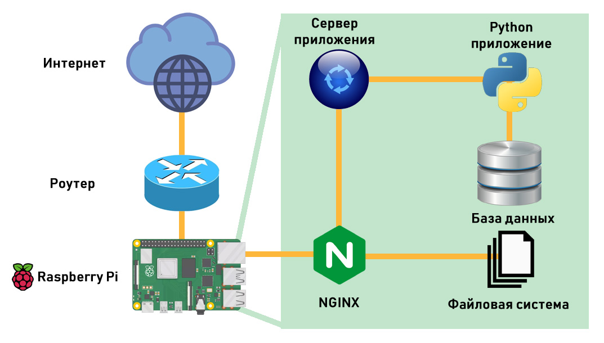

# Архитектура

Бэкенд на python + NGINX для файлов + SQL база данных.

## Основная идея

Весь контент хранится в статических файлах. За доставку файлов отвечает NGINX.
Смысл всей остальной инфраструктуры — удобным образом предоставить пользователю
набор ссылок к этим файлам. Работа системы оптимизирована для чтения, поэтому
используются максимально простые схемы обработки данных. Динамики никакой нет,
пользователи не могут добавлять контент. Любые обновления это критическая
ситуация, требующая вмешательство администратора.

## Последовательность обработки данных

Когда администратор загружает данные, по ним собирается статистика и
генерируются три варианта картинки — оригинальный, для предпросмотра (среднего
размера) и маленькая картинка в качестве иллюстрации на экране поиска.
Собранная метаинформация складывается в базу данных. Поскольку мы лимитированы
в CRUD операциях, а также в памяти и вычислительной мощи, сама работа с этими
данным строится специфическим образом.

Этап подготовки:

1. Админ загружает данные, указывает теги, названия и т.п.
1. Система генерирует три выше описанных варианта данных и складывает их в
   соответствующие каталоги.
1. Система сохраняет в таблицах базы данных всю необходимую информацию о файле,
   его группе, правах доступа и т.д.
1. Админ инициализирует обновление индексов. В качестве индекса выступают
   таблицы в базе данных, в которые складываются все необходимые для работы
   данные. Это примерно те же записи, но добавляются синонимы для тегов,
   переносится часть данных из группы, к которой принадлежит файл и т.п. Также
   строятся таблицы доступа к данным, рассчитывается порядковый номер каждой
   записи и т.д.
1. Админ запускает/перезагружает веб сервер. Сервер исполняется в нескольких
   процессах, однако все они наделены состоянием. Каждый из них держит в памяти
   большую глобальную переменную, которая позволяет выполнять поиск. Логика
   запуска:
    1. Сервер идёт в базу данных и вычитывает из неё всё содержимое нескольких
       специальных таблиц. Под всем содержимым имеется в виду всё содержимое,
       таблица читается целиком и сохраняется в памяти.
    1. Тот же самое делают остальные процессы. Если процессов четыре, значит
       таблица будет прочитана целиком четыре раза. Поскольку запись в неё
       более не производится, предполагается, что все процессы получат
       одинаковое содержимое. Механизмы синхронизации не предусмотрены.
    1. Из прочитанных данных строятся поисковые структуры, по сути — словарики
       с множествами. Далее они будут использованы для организации поиска
       данных. База данных в поиске не участвует.
1. При добавлении новых данных, все шаги повторяются. Данные индексных таблиц
   удаляются и пересчитываются заново, сервер перезагружается. Время даунтайма
   и время запуска сервера в расчёт не принимается. Пользователи потерпят.

Этап использования:

1. Пользователь даёт поисковый запрос с набором тегов и ключевых символов,
   например `cats + dogs - frogs`. Либо не даёт его и тогда система показывает
   ему случайные записи. Поиск осуществляется строго только по тегам и строго
   только по полному соответствию.
1. Поисковый движок подбирает подходящие записи, фильтрует их по запросу и
   правам доступа. Поиск происходит только по структурам в памяти. Потенциально
   это можно было бы делать в redis или внутри базы данных. Но т.к. индексные
   данные имеют небольшой вес и требуют очень высокой скорости обработки, было
   принято решение хранить их только в памяти. Пользователь получает от
   веб-сервера страничку со ссылками на файлы в ней.
1. Браузер пользователя идёт за каждой из указанных картинок. Эти запросы
   обрабатывает NGINX. На каждый запрос он порождает подзапрос к основному
   серверу и убеждается, что данному пользователю разрешено смотреть указанный
   контент. После чего отдаёт пользователю статический файл.

## Плюсы и минусы подхода

Получившаяся система легковесна и очень быстро обрабатывает данные.

Решение с хранением данных в памяти процесса не масштабируется. Когда на
сервере кончится память, надо будет покупать машину побольше. При расходе на
одну запись порядка 7 Кб, предполагается, что в систему (1 гигабайт памяти и 4
процесса, часть памяти тратит база и сервера) влезет ~30 миллионов записей. При
среднем весе одного файла в 1,5 Мб это примерно соответствует хранилищу в 45
Тб.

Хранение данных в виде файликов на диске прекрасно масштабируется. В этом
случае мы бесплатно имеем кеш в виде виртуальной памяти файловой системы.
Носители в виде flash/ssd имеют огромный запас по числу чтений (они
повреждаются главным образом при записи данных). Если на сервере кончится
память, всегда можно добавить ещё одну флешку. Если кончатся разъёмы, можно
купить ещё одну raspberry pi, запустить на ней только NGINX и отдавать файлы с
неё. Подтверждением доступа при этом будет заниматься старый сервер. Если
внезапно система дорастёт до такого большого размера, что производительности
одной машины уже не будет хватать на отдачу файлов, можно организовать
шардирование данных силами только одного NGINX.

Проект является попыткой воплотить концепцию Чистой архитектуры, поэтому
конкретные базы данных и веб сервера не имеют значения (прототип был написан с
хранением данных в виде множества JSON файлов).

В получившейся схеме очень большую головную боль доставляет стадия обновления
данных. Но она выполняется администратором и делается редко. В оставшиеся
99,9% времени пользователи наслаждаются быстродействием системы.